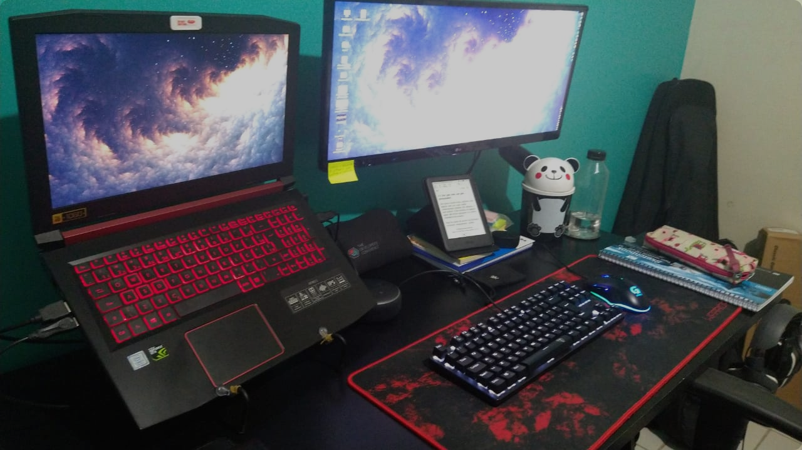

# Introdução

Oláá 🤗 ... Para esse primeiro post no Blog eu optei por falar um pouco das minhas ferramentas de trabalho, o famoso Setup. Então, o intuito do post é compartilhar com vocês tudo que eu uso e que de alguma forma facilita meu dia a dia (terá também um post para falar sobre aplicativos e ferramentas que eu uso pra manter a produtividade e auxiliar na hora de programar /estudar). 

Bem antes da pandemia trazida pelo COVID-19, eu já vinha montando um Setup que me permitisse trabalhar e estudar mais confortavelmente. Para começar nessa missão eu precisava de uma mesa maior, sim eu sou bem espaçosa 😅 , foi ai que eu comprei um combo muito bom de Cadeira e mesa e isso ajudou muito na melhora da minha postura e nas dores recorrentes da tendinite. A Mesa é a [Mesa Gamer XP da Notavel](https://www.madeiramadeira.com.br/mesa-computador-gamer-preto-notavel-nt2020-2793092.html?seller=6537&origem=pla-2793092&utm_source=google&utm_medium=cpc&utm_content=mesas-para-computador-789&utm_term=2793092&gclid=Cj0KCQiAh4j-BRCsARIsAGeV12Bu9waj06PiTpdQxCPuymQc19k27E5ovSsyWKXUB3dR99DTw9VQDAEaAtcTEALw_wcB) e a cadeira é uma [GT Racer](https://www.submarino.com.br/produto/75563132/cadeira-gamer-gt-racer-preto). Depois disso foi só colocar todos os equipamentos na mesa e organizar direitinho.

 Abaixo tem todos os equipamentos que eu uso ⬇️

## Computador

Atualmente eu estou com dois notebooks, um pessoal e outro para trabalhar. O meu Notebook pessoal é um Acer Nitro V e o da empresa é um  Dell Vostro 3480

**Acer Nitro V** que tem a seguinte configuração:

* 16 GB de RAM
* HD 1 TB
* Processador Intel i5 7ª geração – Quad Core 2.5 GHz - 3.5 GHz com Turbo Boost
* GeForce GTX 1050 com 4 GB
* SSD de 256 GB M.2

Além de muito bonita essa máquina é maravilhosa, não tenho o que reclamar ela nunca me deixou na mão! Sua carcaça é muito bem construída com um ótimo sistema de cooler, teclado retro iluminado que quebra um galho enorme. 

**Dell Vostro 3480**

* Processador Intel i5 8a geração - Boost de até 4,1 GHz
* 16 Gb de RAM
* HD 500 GB

O Dell Vostro eu uso para algumas coisas do trabalho, muitas vezes eu opto trabalhar no Mint pela praticidade e liberdade que o Linux promove.  O Dell também é uma ótima máquina, mas eu prefiro o meu Nitro V. 🙃

## Monitor

Gosto bastante desse monitor tanto para trabalho quanto para diversão, por ele ser ultrawide a divisão de telas é uma ajuda e tanto. Na parte de jogos ele não é 144Hz mas os 75Hz que ele entrega faz uma diferença legal dentro dos jogos. Para ver um pouquinho mais sobre ele só [clicar aqui.](https://www.amazon.com.br/gp/product/B01AWG4S4K/ref=ppx_yo_dt_b_asin_title_o03_s00?ie=UTF8&psc=1) 

* Modelo: LG 25UM58-PF
* Ultrawide (25 polegadas)
* Full HD
* Conector de Entrada: 2x HDMI, 1x -Headphone Out

## Periféricos

Muitas vezes eu estou conectada com dois ambientes diferentes em cada máquina(Linux e Windows) e eu confundia muito em qual máquina o periférico estava conectado, esse foi um dos motivos de ter periféricos diferentes para cada ambiente, afinal antes dessa pandemia era necessário ter periféricos diferentes e isso fez com que eu optasse por equipamentos sem fios pela praticidade de deslocamento para transportar até o trabalho.

Começando pelos **suportes**. Eu uso suporte para os notebooks e um suporte articulado para o monitor. Em particular esse suporte articulado para monitor facilitou 100%  a disposição dos meus equipamentos. 

* Suporte articulado para monitor de mesa - ELG F80N ([ver mais aqui](https://www.amazon.com.br/gp/product/B0765KZ264/ref=ppx_yo_dt_b_asin_title_o02_s00?ie=UTF8&psc=1))
* Suporte para notebook, OCTOO, Uptable UP-LB ([ver mais aqui](https://www.amazon.com.br/gp/product/B07BTC67VS/ref=ppx_yo_dt_b_asin_title_o03_s00?ie=UTF8&psc=1))
  - Bandeja Laptop Harry Potter Mapa do Maroto, Imaginarium ([ver mais](https://produto.mercadolivre.com.br/MLB-966030100-bandeja-laptop-harry-potter-mapa-do-maroto-imaginarium-_JM))
    Essa bandeja é muito legal e confortável (além de lindaa 😍), porém não a uso muito já que tenho espaço e conforto suficiente na minha mesa. Ela é ótima para ter um apoio quando você  tem que lidar com o notebook em lugares como camas e sofás. 

Chegou a hora dos periféricos mais usuais: **mouse, teclado, headset e mousepad**. Eu optei por não usar o teclado dos notebooks justamente porque eles ficam suspensos nos suportes. 

* Headset G231 Prodigy, Logitech. ([ver mais](https://www.logitechg.com/pt-br/products/gaming-audio/g231-prodigy-gaming-headset.html))
  - TWS Air Pro GO I2GO, I2GO. ([ver mais](https://www.amazon.com.br/gp/product/B086Y9BS17/ref=ppx_yo_dt_b_asin_title_o02_s00?ie=UTF8&psc=1))
  - In Ear, 110wh, JBL. ([ver mais](https://www.amazon.com.br/gp/product/B086Y9BS17/ref=ppx_yo_dt_b_asin_title_o02_s00?ie=UTF8&psc=1))
  
* Teclado Mecânico Gamer T-Dagger, Led White, Switch Blue, 80% ([ver mais](https://www.kabum.com.br/produto/128030/teclado-mec-nico-gamer-t-dagger-bora-single-led-white-switch-blue-abnt2-t-tgk313-bl-pt-white-))
  - Teclado Pop Color TC402, OEX. ([ver mais](https://www.amazon.com.br/OEX-48-7231-teclado-color-tc402/dp/B084HH46TZ/ref=sr_1_1?__mk_pt_BR=%C3%85M%C3%85%C5%BD%C3%95%C3%91&dchild=1&keywords=teclado+pop&qid=1606539213&s=electronics&sr=1-1))
* Mouse  G402 Hyperion Fury, Logitech. ([ver mais](https://www.kabum.com.br/produto/60302/mouse-gamer-logitech-g402-hyperion-fury-fps-ultra-rapido-4000dpi-910-004069))
  - Mouse PRO M3, Fortrek ([ver mais](https://www.amazon.com.br/gp/product/B07G5JH2HT/ref=ppx_yo_dt_b_asin_title_o00_s00?ie=UTF8&psc=1))
  - Mouse sem fio M170, Logitech (v[er mais](https://www.magazineluiza.com.br/mouse-sem-fio-sensor-optico-1000dpi-logitech-m170/p/220817000/in/mssf/))
  
* Mousepad Warrior AC301, 70 x 30 cm ([ver mais aqui](https://www.amazon.com.br/gp/product/B07642GMJF/ref=ppx_yo_dt_b_asin_title_o03_s01?ie=UTF8&th=1))
  - Mousepad NOX Kron Knout, 32 x 27 cm ([ver mais](https://m.kabum.com.br/produto/89226/mousepad-gamer-nox-krom-knout-kontrol-m-dio-320x270mm-nxkromkntkntrl))

## Outros

Aqui eu listei alguns outros equipamentos que sempre estão comigo e fazem a diferença enquanto estou trabalhando e/ou estudando. 

* Mi Band 3 ([ver mais](https://www.amazon.com.br/Rel%C3%B3gio-Inteligente-Xiaomi-Prova-OLEDTouch/dp/B07DYRNSMS/ref=sr_1_1?__mk_pt_BR=%C3%85M%C3%85%C5%BD%C3%95%C3%91&crid=3BYV4GS9J55L6&dchild=1&keywords=mi+band+3+xiaomi&qid=1606539362&sprefix=miband+3%2Caps%2C284&sr=8-1))
* Echo Dot 3ª Geração ([ver mais](https://www.amazon.com.br/gp/product/B07PDHSJ1H/ref=ppx_yo_dt_b_asin_title_o03_s00?ie=UTF8&psc=1))
* Kindle 10ª geração, iluminação embutida. ([ver mais](https://www.amazon.com.br/Kindle-10a-gera%C3%A7%C3%A3o-ilumina%C3%A7%C3%A3o-embutida/dp/B07FQK1TS9/ref=pd_vtp_107_1/136-5903477-4837818?_encoding=UTF8&pd_rd_i=B07FQK1TS9&pd_rd_r=db5a1012-9e47-4f1a-a124-56263fe9fd1f&pd_rd_w=rd6J8&pd_rd_wg=RzBMu&pf_rd_p=e7d70f47-78b1-4fb7-afa6-764f723cbb07&pf_rd_r=P994F5J0172SNF2H7RT6&psc=1&refRID=P994F5J0172SNF2H7RT6))
* Capa com apoio vertical, WB Premium Freedom ([ver mais](https://www.amazon.com.br/gp/product/B07XVR9BSJ/ref=ppx_yo_dt_b_asin_title_o01_s00?ie=UTF8&psc=1))
  - Essa capa é realmente maravilhosa, ela permite apoiar o Kindle tanto na vertical quanto na horizontal, o que facilita muito a leitura além de ser bastante confortável para manusear o kindle.

## Conclusão

E assim chegamos ao fim, obrigada e até próximo post! 👋

